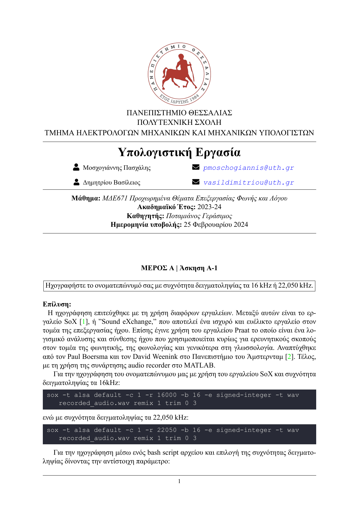

# Voice Processing and Synthesis Project

This repository contains the code and materials for the "Voice Processing & Speech" project, part of the course "ΜΔΕ671 Προχωρημένα Θέματα Επεξεργασίας Φωνής και Λόγου
" (PGS671 Advanced Topics in Speech and Language Processing), as part of the curriculum of the Department of Electrical and Computer Engineering which belongs to the School of Engineering of the University of Thessaly for the academic year 2023-24.

## Project Description

Click on the GIF to open the PDF.

This project focuses on processing and synthesizing voice signals using MATLAB. It consists of two main parts:

### Part A: Basic Voice Parameter Estimation Algorithms (65%)

- **Recording:** Record your name with a sampling frequency of either 16 kHz or 22,050 kHz.
- **Voice Signal Spectrogram:** Plot the spectrogram of the recorded voice signal using Hamming windows of length around 10 ms and 100 ms, with a shift of approximately 5 ms.
- **Voiced/Unvoiced Segments Estimation:** Design an algorithm to distinguish voiced, unvoiced, and silent segments of the signal using energy and zero-crossing rate calculations.
- **Fundamental Frequency Estimation:** Implement a method to find the fundamental frequency (pitch) of voiced segments using methods like autocorrelation or cepstrum.

### Part B: Simple Voice Synthesis System (35%)

- **Synthetic Sound Generation:** Generate a synthetic sound signal with a sampling frequency of 10 kHz and a duration of 3 seconds, composed of six vowels (/AO/, /IY/, /UH/, /EH/, /AH/, /IH/) each lasting 0.5 seconds.
- **Glottal Pulse Model:** Model the glottal pulse using the given equations and parameters.
- **Vocal Tract Model:** Model the vocal tract as a filter using the given formant frequencies and bandwidths.
- **Radiation Load Model:** Model the radiation load using the provided equation.
- **Sound Synthesis:** Synthesize the voice signal by convolving the above components.
- **Signal Analysis:** Analyze the synthesized signals and compare them with natural voice signals.

## Project Submission

Click on the image to open the PDF.

The project submission includes:

- A report (in PDF) explaining the implemented algorithms and methods, including diagrams and results.
- Audio files (.wav) of the recorded voice signal and synthesized voice signals.
- MATLAB code files (.m) containing the implemented algorithms and synthesis system.

## Group Information

- Group Size: Up to 2 members
- Submission Deadline: 25/02/24
- Oral Examinations: Week of 26/02-01/03

## Usage

To use the MATLAB code provided in this repository, simply clone or download the repository and run the MATLAB scripts in a MATLAB environment.

## Contributors

- Paschalis Moschogiannis (Contact: [pmoschogiannis@uth.gr](mailto:pmoschogiannis@uth.gr))
- Vasileios Dimitriou (Contact: [vasildimitriou@uth.gr](mailto:vasildimitriou@uth.gr))

## License

This project is licensed under the

⚖ [GNU General Public License Version 3 (GPLv3)](LICENSE)

 

